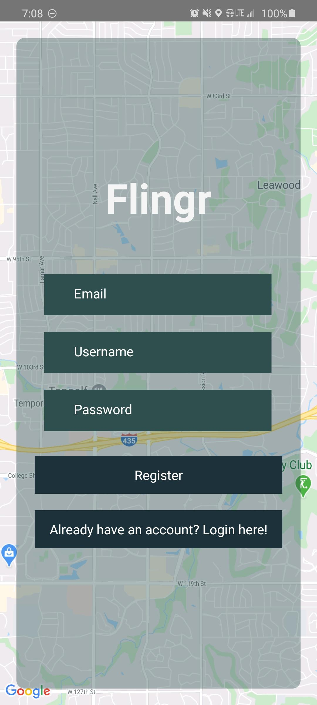
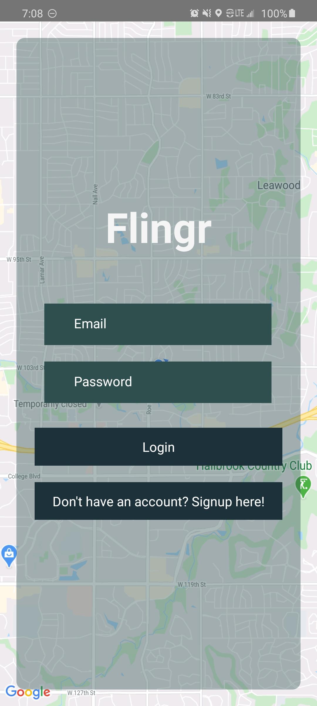
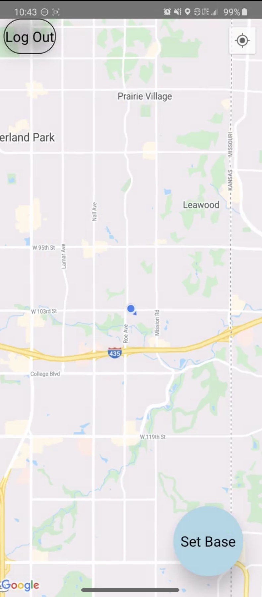
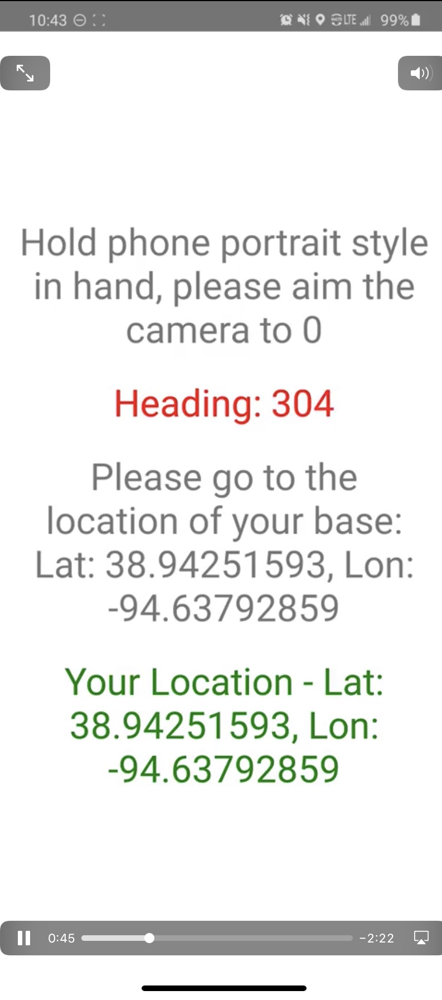
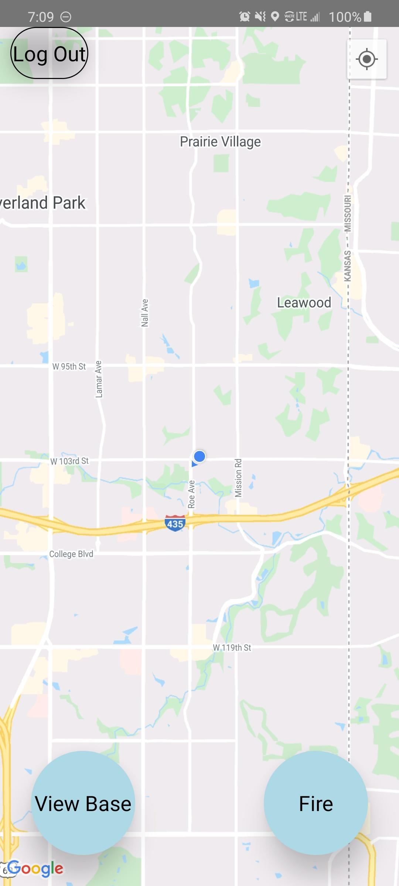
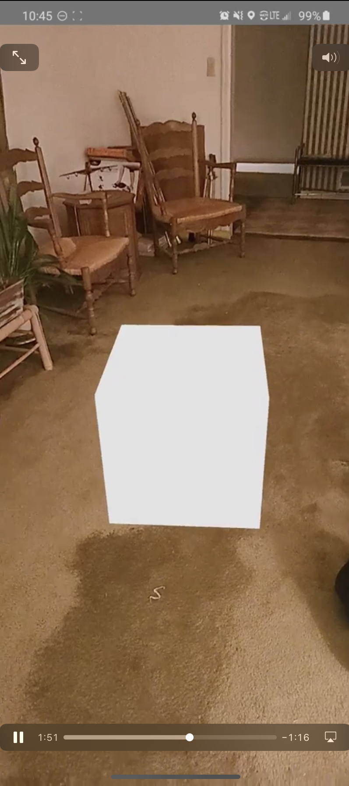
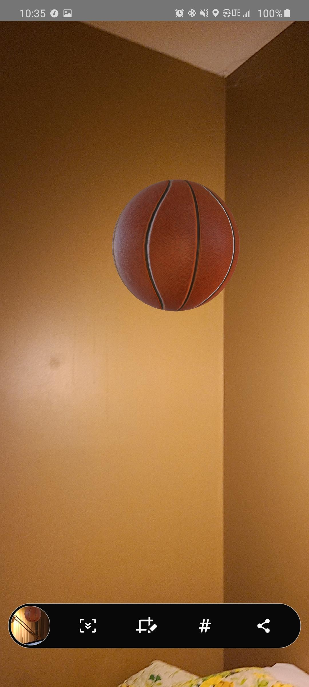

# User Manual

## About Flingr
 Flingr is a game that allows players to launch a projectile to other players at different locations in the real world.

## How to Install Flingr?
 Refer to the Getting Started portion of the ReadMe for more information on how to install Flingr into your local device.
* [Flingr](https://github.com/Reed-Schimmel/Flingr)

## Getting to know Flingr

1. When you launch the app, you will be directed to the Registration Screen.
 

2. Enter the information required and click on the 'Register' button to create an account.

3. If you already have an account, click on the 'Already have an account? Login here!' button to be directed to the Login Screen.

4. Enter the information required and click on the 'Login' button to sign in to your account.

5. Once you are logged in, you will be directed to the Map Screen. The blue dot and arrow indicates your position.

6. Click on the 'Set Base' button to set your base.

7. If you click on the 'View Base' button, it will show you what your own base looks like.

8. If you click on the the 'Fire' button, it will take you to an AR screen where you can see your projectile (basketball).

9. The ball will center on the screen and will follow the center of the camera. You have to aim the ball with the phone. To launch the ball, you have to touch the screen where the ball is.

10. Click on the 'Log Out' button if you choose to exit the app.

11. And there you have it! 10 simple ways to get started with Flingr. Enjoy the game!
